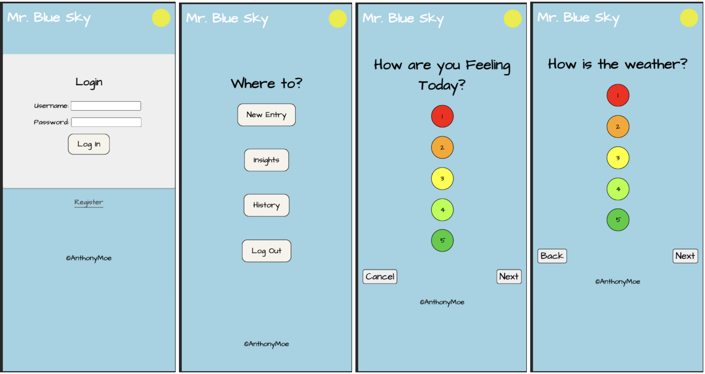
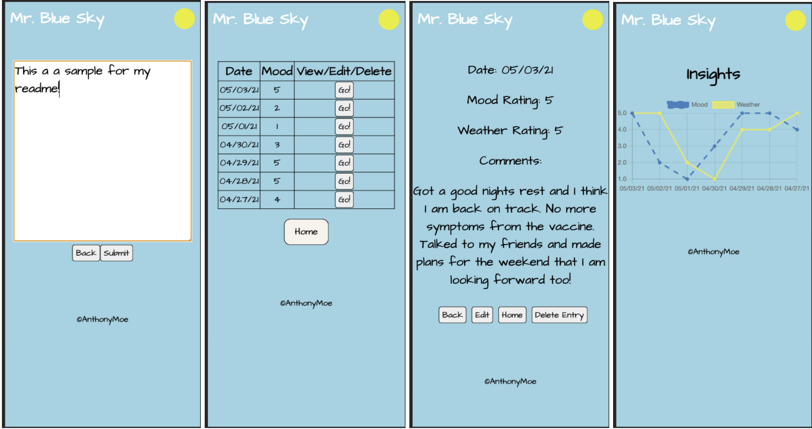

         
    
# Mr. Blue Sky - Solo Project

## Description

I created a mobile first application called Mr. Blue Sky. This application will help users begin to understand why they feel the way that they do and how external factors impact their mood. 

Mr. Blue Sky can be used as a basic journaling application, however what sets it apart is that it allows the user to view correlation between mood and weather. 

## Try me

https://mr-blue-sky.herokuapp.com/#/login 

for best results inspect in google chrome using the iphoneX setting. 

Tech used: 
* React
* Redux
* HTML
* CSS
* javaScript
* Node.js
* Express
* PostgreSQL 
* Chartjs

## Thank You
I would like to give a special thank you to my instructor Dev Jana and my fellow Emirp cohort classmates for helping me achieve this goal. 

## Sources: 
 Github Source - chart.js
https://github.com/reactchartjs/react-chartjs-2/blob/master/example/src/charts/Line.js